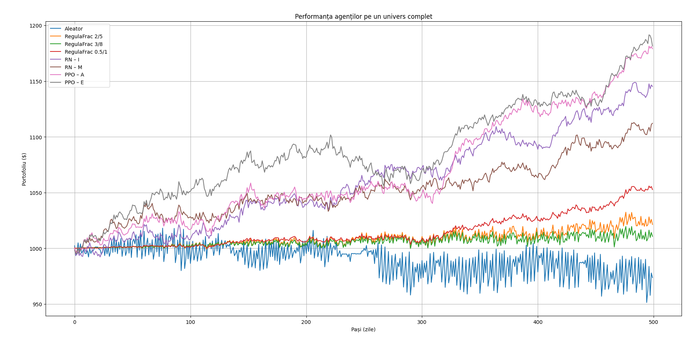
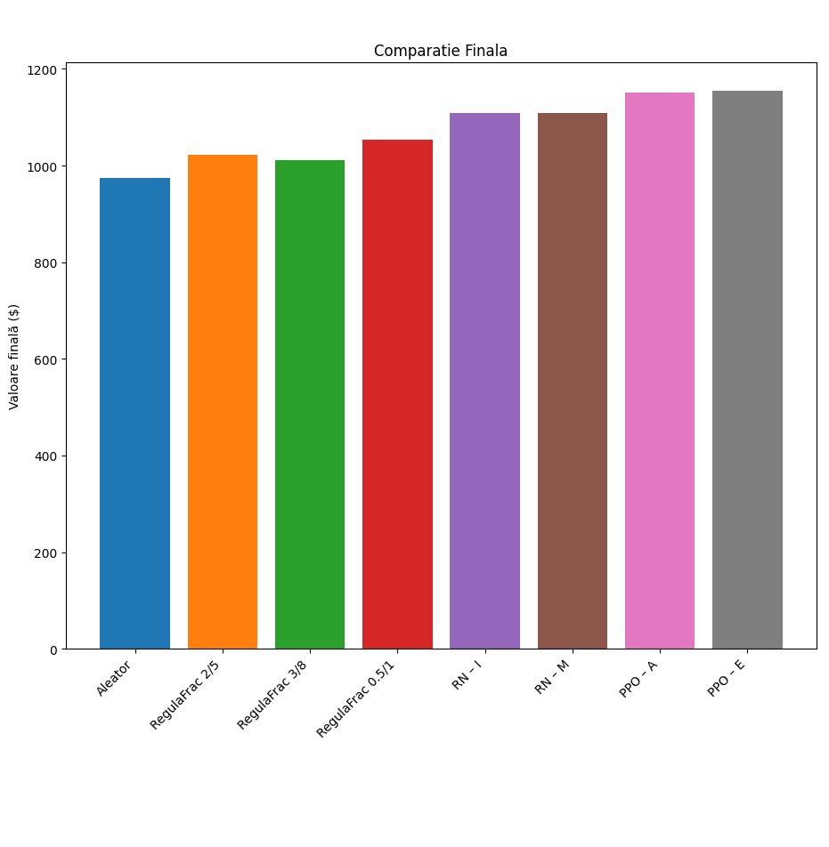
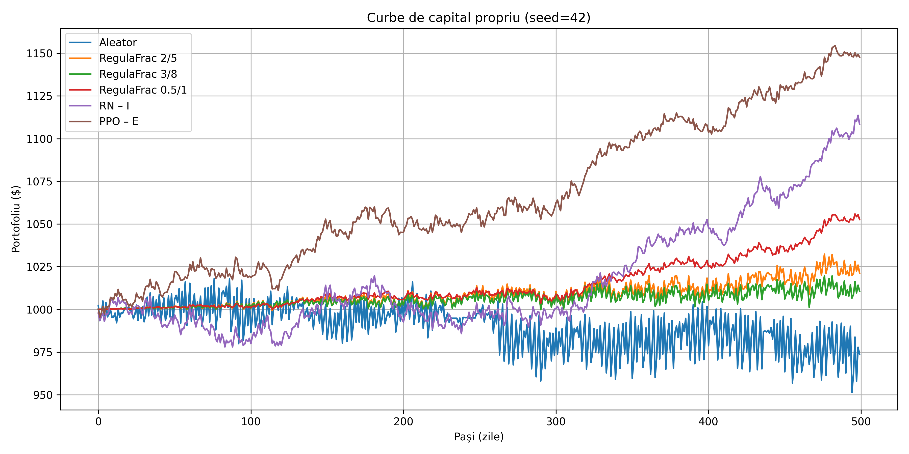

# Virtual-trading-market-NeuralNetwork-

Această lucrare propune un cadru complet pentru simularea şi evaluarea automată a strategiilor de tranzacţionare pe pieţe sintetice. În prima parte, definim trei modele stocastice (mișcarea geometrică browniana, Ornstein–Uhlenbeck, harta logistică) pentru generarea de serii de preţuri, apoi implementăm un mediu modular de tip Gym care suportă atât acţiuni discrete, cât şi fracţionare, cu comisioane şi perioade minime de deţinere. 

Pe acest mediu virtual, comparăm patru familii de agenţi: un agent cu comportament aleator, agenţi euristici bazate pe praguri de preţ, doi agenți bazați pe rețele neuronale și anume un agent bazat pe algoritmul REINFORCE şi un agent bazat pe algoritmul PPO. Sunt folosite doua script-uri principale pentru a organiza experimentele, unul pentru comparația inițială și unul pentru analiza de robustete, iar rezultatele sunt prezentate sub formă de curbe de portofoliu, bar chart‐uri finale şi tabele statistice (medii şi deviaţii standard). În timp ce algoritmul REINFORCE oferă randamente bune, dar mai variabile, rezultatele arată că agenții PPO performează mai bine, în special varianta ”expert”, care îmbină randamentul ridicat cu stabilitatea. 

---

## Descriere pe scurt

- **Date sintetice**:  
  - **GBM** (Geometric Brownian Motion) pentru drift aleator cu volatilitate constantă  
  - **OU** (Ornstein–Uhlenbeck) pe log-price pentru mean-reversion  
  - **Harta logistică** pentru evenimente haotice și salturi mari  

- **Mediu de simulare** (`MarketEnv`):  
  - **Discrete**: acțiuni întregi (hold/buy/sell)  
  - **Fracționar**: tranzacționare procentuală din cash sau din holding  
  - Cost de tranzacție și perioadă minimă de deținere configurabile  

- **Agenți**:  
  - **RandomAgent** – baseline pur aleatoriu  
  - **RuleBasedAgent** – praguri simple „cumpără la -X%, vinde la +Y%”  
  - **NNAgent** – politică parametrizată, antrenată cu REINFORCE  
  - **PPOAgent** – variantă Proximal Policy Optimization cu clipping și bonus de entropie  

- **Protocol experimental**:  
  1. **main_comparison()** – antrenează (dacă e cazul) și evaluează toți agenții pe același univers de 500 de zile  
  2. **seed_sweep()** – repetă rulajul cu mai multe seed-uri pentru a măsura robustețea  

---

## Câteva rezultate reprezentative

### Equity curves (500 de zile)

### Bar chart valori finale

### Exemplu per-seed (seed=42)

---

## Structura proiect
- data/ # serii CSV generate (stock_1.csv …)
- env/ # implementări MarketEnv*
- agenti/ # Random, RuleBased, NNAgent, PPOAgent
- scripts/ # main_comparison.py, seed_sweep.py
- poze/ # grafice PNG/PDF pentru figuri

---

În documentație detaliată veți găsi:
- explicațiile teoretice (modele SDE și algoritmi RL)  
- arhitectura OOP a mediului și agenților  
- analiza statistică (pivot tables, mean±std)  
- recomandări de extensie (date reale, episoade suplimentare, hibrid forecasting+RL)  

---  
